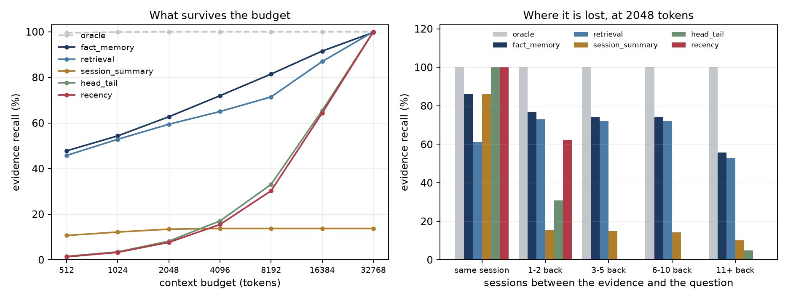

<div align="center">

# retainkit

[](https://github.com/mohammadi-hadi/retainkit/actions/workflows/ci.yml)
[](https://www.python.org/downloads/)
[](LICENSE)

*Context and memory policies for LLM agents, scored by the evidence that survives the token budget.*

</div>

An agent that has been talking to someone for thirty sessions cannot put all of
it in the prompt. Something is dropped on every turn, and what is dropped
decides which questions the agent can still answer. That decision is usually
made by a default in a framework: keep the last N messages, summarise the rest.

retainkit measures the decision. Give it a conversation, a question, the turns
that support the answer, and a budget; it reports whether those turns are still
in front of the model, how much of the budget went on them, and how the answer
gets worse the further back the evidence sits.

## 1,527 questions over ten long conversations

[LoCoMo](https://github.com/snap-research/locomo) records ten conversations
running 19 to 32 sessions each. Every question names the turns that answer it.
An average conversation is 23,056 tokens; the evidence for the average question
is **84 of them**, so 0.4% of the transcript carries the answer and the other
99.6% is the search problem.

At 2,048 tokens, 8.9% of the conversation:

| Policy | Sees the question | Recall | 95% CI | Whole turns |
| --- | :---: | ---: | --- | ---: |
| `oracle` (keeps only the evidence) | yes | 100.0% | 100.0–100.0% | 100.0% |
| `fact_memory` | yes | 62.7% | 60.2–65.1% | 3.9% |
| `retrieval` | yes | 59.5% | 56.8–62.0% | 59.5% |
| `session_summary` | no | 13.4% | 11.7–15.2% | 2.0% |
| `head_tail` | no | 8.2% | 6.9–9.6% | 8.2% |
| `recency` | no | 7.7% | 6.4–9.0% | 7.7% |

A sliding window at this budget answers 7.7% of what it could. Reading the
question first takes that to 59.5% for the same money. Put the other way: a
window needs 16,384 tokens to reach the 50% that retrieval reaches at 1,024.



The right panel is where the money is. Recency holds every question whose
evidence is in the session in progress and 62.3% of the ones a session or two
back. Three sessions back it holds **none of them**, while retrieval is still at
72.1%. Long-term memory is a different problem from the window problem, and the
window scores zero on it.

Full numbers, including every budget from 512 to 32,768 and a split by question
type: [`examples/locomo/results/locomo.md`](examples/locomo/results/locomo.md).

## Two results that do not flatter the tooling

**Multi-hop questions are not solved by retrieval.** At 2,048 tokens the best
policy holds the evidence for 76.8% of single-hop questions and 16.2% of
multi-hop ones. A multi-hop question needs several turns from several sessions
at once, and one query against a store tends to bring back one of them. Anyone
reporting a single memory-recall number is averaging over this gap.

**`fact_memory` wins on a technicality worth knowing about.** It stores
sentences rather than turns, so it fits more of the conversation into the same
budget and scores 62.7% against retrieval's 59.5%. But the whole evidence turn
survives only 3.9% of the time; the rest of its wins hand the model one sentence
out of several. Whichever column you take as the real one, take the same column
for every policy.

## What is being measured

Whether a named span survived, and nothing else. A model handed the evidence can
still answer wrongly, so every number here is a ceiling on what any model behind
the policy could do, not a score for the model. The point of a ceiling is that it
is cheap: no API calls, no judge, no variance between runs, and a policy that
loses the evidence is not worth benchmarking end to end.

The same convention rules out one thing: an abstractive summariser rewrites what
it keeps, and a rewritten sentence cannot be traced to a turn. The summary policy
here is extractive so that survival stays answerable. Token counts come from a
four-characters-per-token estimate, which moves absolute numbers around by up to
22 points for a window policy, so pass your own tokenizer if the budget has to be
exact. It does not move which policies win, and there is a test holding it to that.

## Install

```bash
pip install retainkit
```

No runtime dependencies. `pip install "retainkit[viz]"` adds matplotlib for the
figures.

## Use

```python
from retainkit import Case, Probe, Recency, Retrieval, Transcript, Turn, run, sweep_table

case = Case(
    transcript=Transcript(
        id="guest-42",
        turns=(
            Turn(id="s1:1", session=1, speaker="guest", text="I never eat shellfish."),
            Turn(id="s1:2", session=1, speaker="agent", text="Noted, thank you."),
            Turn(id="s9:7", session=9, speaker="guest", text="Book me somewhere near the water."),
        ),
    ),
    probes=(Probe(id="q1", question="What can this guest not eat?", evidence=("s1:1",)),),
)

print(sweep_table(run([case], (Recency(), Retrieval()), budgets=(64, 512))))
```

Your own conversations go in as JSON and out as a report:

```bash
retainkit eval conversations.json --budget 2048 --budget 8192 --out results/
```

The file format is in [`src/retainkit/io.py`](src/retainkit/io.py). `retainkit
demo` runs a seeded fixture and needs no data at all.

## The policies

| Policy | Keeps | Reads the question |
| --- | --- | :---: |
| `recency` | The newest turns that fit. | no |
| `head_tail` | The opening of the conversation and the newest turns. | no |
| `session_summary` | The live session, plus the lead sentences of each closed one. | no |
| `retrieval` | The turns that rank highest against the question, put back in order. | yes |
| `fact_memory` | The live session, plus sentences pulled from a long-term store. | yes |
| `oracle` | The evidence and nothing else. Not runnable in production. | yes |

A policy is anything with a `name`, a `query_aware` flag and a `select` method,
so your own goes straight into the same sweep:

```python
class KeepEverySecondTurn:
    name = "every_second"
    query_aware = False

    def select(self, transcript, probe, budget, tokenizer):
        from retainkit.policies import fill, package
        from retainkit.policies.base import turn_fragments

        kept, _ = fill(turn_fragments(transcript)[::2], budget, tokenizer)
        return package(self.name, budget, kept, tokenizer)
```

## Reproducing

```bash
make install
make test
make demo                      # the seeded fixture, written to results/
python examples/locomo/fetch_data.py
python examples/locomo/run_locomo.py
```

LoCoMo is fetched at run time and is not redistributed here; it carries the terms
of its own release. The fixture results in `results/` are rebuilt by CI on every
push and the build fails if a committed number no longer matches the code, so
nothing quoted above can drift away from what the package produces.

## Citing

```bibtex
@software{mohammadi_retainkit,
  author  = {Mohammadi, Hadi},
  title   = {retainkit: context and memory policies for LLM agents,
             scored by the evidence that survives the token budget},
  year    = {2026},
  url     = {https://github.com/mohammadi-hadi/retainkit},
  license = {MIT}
}
```

LoCoMo is by Maharana et al., *Evaluating Very Long-Term Conversational Memory
of LLM Agents*, ACL 2024. Cite it if you use these results.

## Related

[judgekit](https://github.com/mohammadi-hadi/judgekit) audits an LLM judge,
[arenakit](https://github.com/mohammadi-hadi/arenakit) audits a pairwise
leaderboard, [trajectory-judge](https://github.com/mohammadi-hadi/trajectory-judge)
scores agent trajectories. More at [mohammadi.cv](https://mohammadi.cv).
